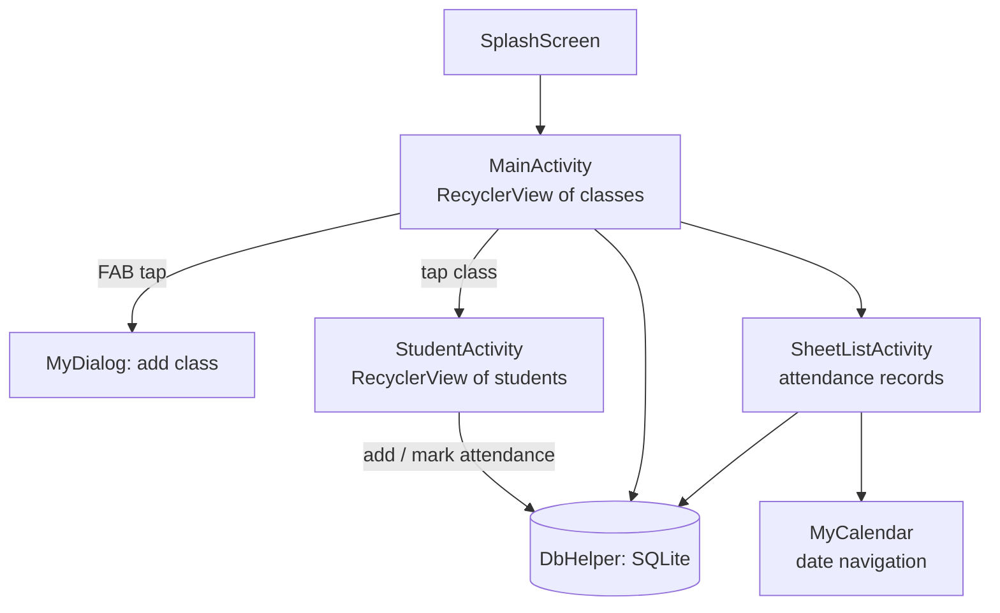

# update_AttendanceApp

Android app for tracking class attendance — manage a list of classes, drill into each to manage a roster of students, and mark attendance, all backed by a local SQLite database.

## How it works

`MainActivity` shows a `RecyclerView` of classes (`ClassItem`/`ClassAdapter`), loaded from `DbHelper` (a SQLite `SQLiteOpenHelper`); a floating action button opens `MyDialog` to add a new class. Tapping a class opens `StudentActivity`, which lists that class's students (`StudentItem`/`StudentAdapter`) and lets the user add students or mark attendance, also persisted via `DbHelper`. `SheetListActivity` provides a separate view for reviewing attendance records, and `MyCalendar` supports date-based navigation of those records. `SplashScreen` is the app's entry point before `MainActivity`.

## Architecture

| File | Role |
|---|---|
| `MainActivity.java` | Class list + entry point to students/records |
| `DbHelper.java` | SQLite schema + CRUD for classes/students/attendance |
| `StudentActivity.java`, `StudentAdapter.java`, `StudentItem.java` | Per-class student roster + attendance marking |
| `ClassAdapter.java`, `ClassItem.java` | Class list rendering |
| `SheetListActivity.java`, `MyCalendar.java` | Attendance record review by date |
| `MyDialog.java` | Add-class dialog |
| `SplashScreen.java` | App entry point |

## Tech stack

Java · Android `RecyclerView` · SQLite

## Setup

Open in Android Studio and run on an emulator/device.
